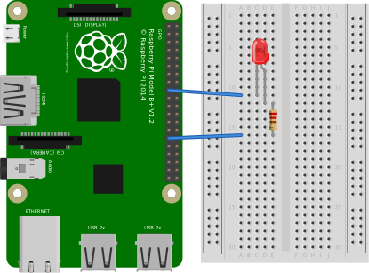

# open-gpio


Small easy project to controll a gpio port of a raspberry pi via python and mqtt.<br>
[[Logo created with diagram.net]](https://app.diagrams.net/)<br>
<br>
<br>
<br>

Used technolgies:

- GPIO – General Purpose Input/Output
- MQTT - Message Queuing Telemetry Transport
- Docker - Building and sharing containerized application.

## Hardware Example
The *"Hello World"* example to use this python scripts.

<center></center>

## Software Example

1. Let a LED blink via Python

```python
python ./simple-gpio.py
```

2. Execute the Pythonscript inside a Docker Container

```python
cd src/simple-gpio/
docker build -t "simple-gpio:v1" .
docker container run --name simple-gpio --device /dev/gpiomem -d simple-gpio:v1
```

3. Execute in a Docker Container and start it over MQTT

```python
cd src/mqtt_led/
docker build -t "mqio:v1" .
docker container run --name mqio --device /dev/gpiomem -d mqio:v1
```

4. Execute it via Google Home

```python
* Google Assistant --> IFTTT
* IFTTT --> OpenHab
* OpenHab --> MQTT
* MQTT --> LED
```

## Author

**Alexander Hartmann** - [movative](https://github.com/movative)
